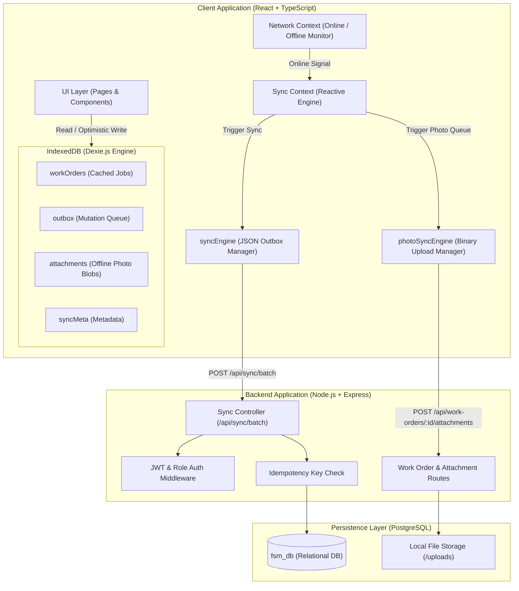
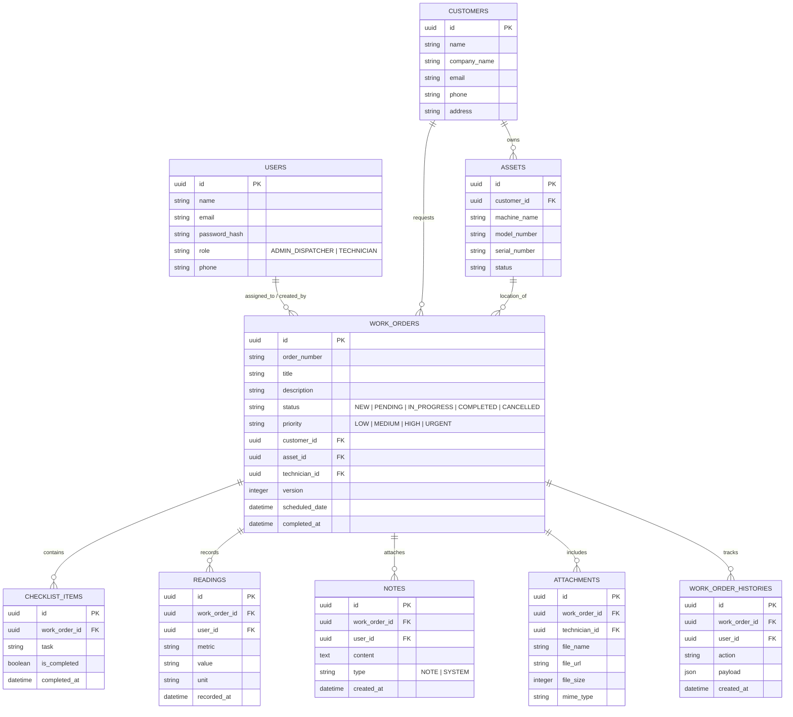

# 📐 System Architecture & Data Model Documentation

This document outlines the system architecture, offline persistence strategy, database schema, and detailed architectural answers for the **Offline-First Field Service Management Application**.

---

## 1. High-Level System Architecture Diagram



---

## 2. Database ER Diagram (PostgreSQL Data Model)



---

## 3. Dexie IndexedDB Schema (Client Storage)

```typescript
// Dexie Database Schema definition (frontend/src/services/db.ts)
this.version(1).stores({
  workOrders: 'id, orderNumber, status, technicianId, customerId, assetId, _syncStatus',
  outbox: 'mutationId, workOrderId, actionType, timestamp, status',
  attachments: 'id, workOrderId, status, createdAt',
  syncMeta: 'key',
});
```

---

## 4. Architectural Questions & Explanations

### Q1: What data is stored locally, and why?
- **Data Stored**: Assigned work orders (including customer/asset details and checklists), local outbox mutations, and offline camera photos (as raw `Blob` data).
- **Rationale**: Field technicians frequently lose cellular signals inside basements or remote industrial sites. Storing work orders in IndexedDB ensures **0ms render latency** and allows 100% of field operations to continue without network access.

### Q2: How do you represent pending changes?
- **Outbox Queue Pattern**: Pending changes are represented as atomic mutation objects stored in the `outbox` table in IndexedDB:
  ```json
  {
    "mutationId": "mut_1787195000_abc123",
    "workOrderId": "4a34fa9b-975c-4581-8813-2c81cfef9a99",
    "actionType": "COMPLETE_JOB",
    "payload": { "status": "COMPLETED", "completedAt": "2026-08-20T09:00:00Z" },
    "timestamp": 1787195000000,
    "status": "PENDING"
  }
  ```

### Q3: How do you detect server data changes while a technician was offline?
- **Version Tracking**: Every work order contains a numeric `version` property (incremented on each update). When the technician attempts to sync an offline status change, the server compares the client's `version` against the current database `version`. If the status on the server was updated to `CANCELLED` by an admin in the interim, a conflict is detected.

### Q4: How are conflicts resolved?
- **Explicit Conflict Flagging (No Silent Data Loss)**: When a version mismatch or state conflict occurs:
  1. The server flags the mutation result as `{ status: "CONFLICT", errorMessage: "..." }`.
  2. The client outbox marks the mutation with `status: "CONFLICT"`.
  3. Auto-sync ignores `CONFLICT` items so they are **never overwritten or re-sent**.
  4. The technician is alerted in the **Outbox Drawer (Conflicts Tab)** to review and manually resolve or discard the conflicting change.

### Q5: How do you make retries idempotent?
- **Idempotency Header & Transactional Locks**:
  1. Every mutation contains a unique `mutationId` generated at creation time.
  2. Requests include the `X-Idempotency-Key` HTTP header.
  3. The backend checks an in-memory/DB idempotency table. If the `mutationId` has already been processed, the server skips duplicate side effects and returns the original cached success result.

### Q6: How do attachment uploads differ from normal data synchronization?
- **Binary vs JSON Separation**:
  - Normal data changes (status, notes, readings) are lightweight JSON payloads processed in a single batch endpoint (`/api/sync/batch`).
  - Photos are large binary `Blob` objects stored separately in IndexedDB (`attachments` table) and uploaded via multipart `FormData` through `photoSyncEngine` to prevent blocking JSON outbox processing.

### Q7: What happens if synchronization stops halfway through?
- **Atomic Batch Results & Partial Failure Tolerance**:
  - The server processes mutations sequentially and returns per-mutation results: `[{ mutationId: 'm1', status: 'SYNCED' }, { mutationId: 'm2', status: 'FAILED' }]`.
  - Only mutations marked as `'SYNCED'` are deleted from the local IndexedDB outbox.
  - Remaining items retain their `'PENDING'` status and will automatically resume on the next sync cycle without re-processing already synced items.

### Q8: How do you prevent unauthorized access to work orders?
- **Role-Based Server Authorization**:
  - JWT authentication middleware verifies user identity on every API route.
  - Field technicians are restricted at the database query level (`WHERE technician_id = req.user.id`). Technicians cannot query or modify work orders assigned to other technicians.

### Q9: What would become a bottleneck if the system grew significantly?
- **Potential Bottlenecks & Solutions**:
  1. **Monolithic Batch Endpoint**: Processing large outbox queues synchronously in a single HTTP request could cause timeouts. *Solution: Queue outbox mutations in Redis (BullMQ / RabbitMQ) for async worker processing.*
  2. **Image Storage Volume**: Storing full-resolution photos locally on backend disk. *Solution: Direct client presigned URLs to AWS S3 / Cloudflare R2.*

### Q10: What would you improve with an additional month of development time?
1. **Delta-Sync Protocol**: Instead of downloading entire work order objects, transfer JSON patch deltas (`RFC 6902`).
2. **Background Sync Service Worker**: Use Web Background Sync API (`self.registration.sync.register()`) to sync outbox changes even when the browser tab is closed.
3. **Field Asset QR Code Scanner**: Allow technicians to scan equipment QR codes offline to load asset maintenance history.
