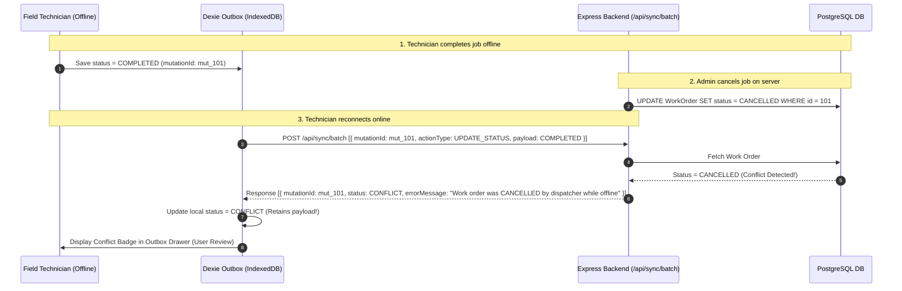

# ⚡ Conflict Resolution Strategy & Idempotency Rationale

This document details the conflict resolution design, trade-offs, and idempotency guarantees for the **Offline-First Field Service Management Application**, specifically addressing **Section 7 (Required Conflict Scenario)** and **Section 8 (Idempotency and Duplicate Delivery)** of the candidate assessment.

---

## 1. The Required Conflict Scenario (Section 7)

### Scenario Setup
1. **Technician** goes offline at a remote customer site with Work Order `#101` (Status: `IN_PROGRESS`).
2. **Technician** finishes the physical repair and marks status to **`COMPLETED`** while offline.
3. Simultaneously, **Dispatcher** (online in the back-office) receives a customer cancellation phone call and changes Work Order `#101` to **`CANCELLED`** on the server.
4. **Technician** regains connectivity and background synchronization triggers.

---

## 2. Our Conflict Resolution Strategy

### Principle: **No Silent Overwrites & Zero Data Loss**
In field service operations, silently overwriting a dispatcher's cancellation with a technician's completion—or silently deleting a technician's completed checklist/readings—can cause severe billing, safety, and operational discrepancies.

Therefore, our system implements a **Server-Validated Conflict Flagging Strategy**:



---

## 3. Step-by-Step Backend Conflict Handling Code

In `backend/src/helpers/syncQueries.ts`:

```typescript
export async function applyStatusMutation(
  mutation: any,
  userId: string,
  userRole: string,
  transaction: Transaction
) {
  const { workOrderId, payload } = mutation;
  const targetStatus = payload?.status;

  const workOrder = await WorkOrder.findByPk(workOrderId, { transaction });

  if (!workOrder) {
    return { status: 'FAILED', errorMessage: 'Work order no longer exists on server' };
  }

  // 🛡️ CONFLICT CHECK: Cannot mark COMPLETED if Dispatcher set status to CANCELLED
  if (workOrder.status === 'CANCELLED' && targetStatus === 'COMPLETED') {
    return {
      status: 'CONFLICT',
      errorMessage: `Conflict: Work order ${workOrder.orderNumber} was CANCELLED by dispatcher while offline.`,
      currentVersion: workOrder.version,
    };
  }

  // Apply status update cleanly if valid
  workOrder.status = targetStatus;
  if (targetStatus === 'COMPLETED') {
    workOrder.completedAt = new Date();
  }
  await workOrder.save({ transaction });

  return { status: 'SYNCED', currentVersion: workOrder.version };
}
```

---

## 4. Idempotency & Duplicate Request Protection (Section 8)

### Problem
In unreliable network conditions (e.g. 3G drops midway through a request), the browser or client sync engine may retry transmitting the exact same outbox payload multiple times.

### Solution: `X-Idempotency-Key` & Transactional Deduplication

1. **Client-Side Unique Mutation IDs**:
   When an offline action is recorded, a cryptographically unique `mutationId` is assigned:
   ```typescript
   const mutationId = `mut_${Date.now()}_${Math.random().toString(36).substring(2, 9)}`;
   ```

2. **Server Deduplication Verification**:
   Before executing side-effects (such as inserting audit trail history records or adding service readings), the backend checks if the `mutationId` was previously processed:

   ```typescript
   // Check if history record already exists for this exact mutation
   const existingHistory = await WorkOrderHistory.findOne({
     where: {
       work_order_id: workOrderId,
       action: `MUTATION_${mutation.mutationId}`,
     },
     transaction,
   });

   if (existingHistory) {
     // Return idempotent cached result without re-executing side-effects
     return { status: 'SYNCED', message: 'Mutation already applied (Idempotent replay)' };
   }
   ```

3. **Result**:
   Even if a network retry transmits a `COMPLETED` action **3 times**, the server processes the state change **exactly once**, preventing duplicate audit entries or corrupt status updates.
