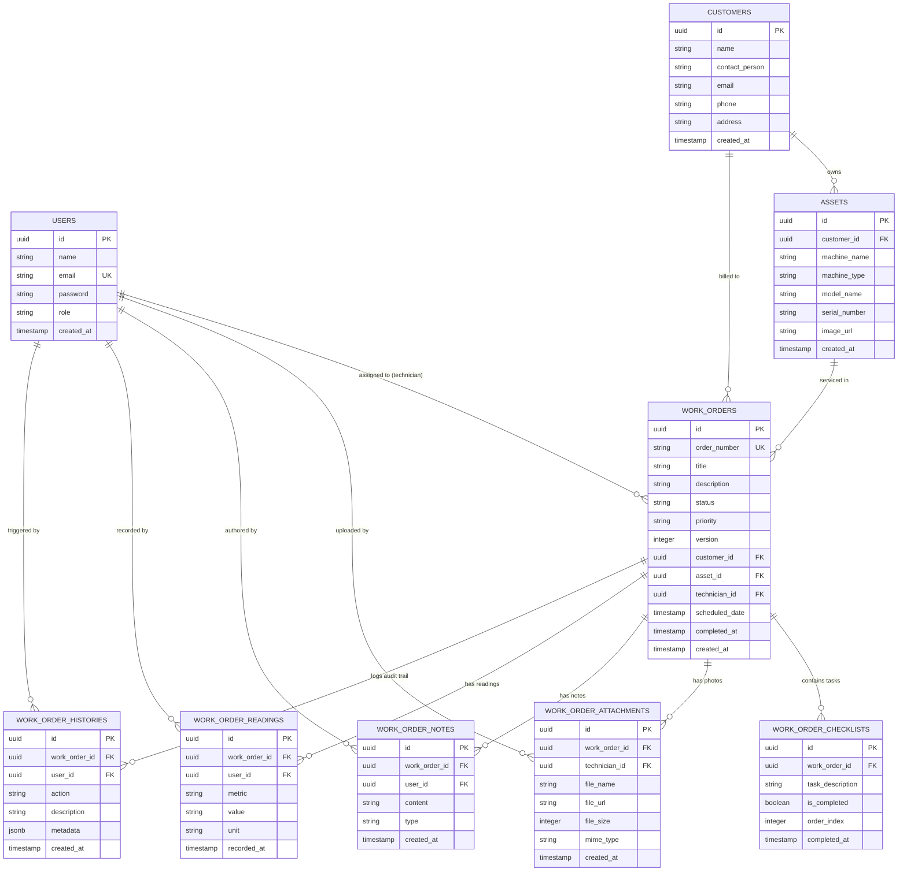

# 🗄️ Primary Database ER Diagram & Data Model Documentation

This document provides a full Entity-Relationship (ER) diagram and table-by-table schema documentation for the **FieldFlow Offline-First Field Service Management PostgreSQL Database (`fsm_db`)**.

---

## 1. Entity-Relationship Diagram (Mermaid)

---

## 2. Table Specifications & Indexes

### 2.1 `users`
Stores user authentication profiles and RBAC system roles (`ADMIN_DISPATCHER`, `TECHNICIAN`).
- **Primary Key**: `id` (`UUID`)
- **Indexes**: `UNIQUE INDEX idx_users_email (email)`

### 2.2 `customers`
Stores client organization profiles and billing contacts.
- **Primary Key**: `id` (`UUID`)

### 2.3 `assets`
Stores customer equipment machinery details.
- **Primary Key**: `id` (`UUID`)
- **Foreign Keys**: `customer_id` -> `customers(id)` (`ON DELETE SET NULL`)

### 2.4 `work_orders`
Primary operational work order header entity with optimistic concurrency versioning (`version`).
- **Primary Key**: `id` (`UUID`)
- **Foreign Keys**:
  - `customer_id` -> `customers(id)` (`ON DELETE CASCADE`)
  - `asset_id` -> `assets(id)` (`ON DELETE CASCADE`)
  - `technician_id` -> `users(id)` (`ON DELETE SET NULL`)
- **Indexes**:
  - `UNIQUE INDEX idx_wo_order_number (order_number)`
  - `INDEX idx_wo_status (status)`
  - `INDEX idx_wo_technician (technician_id)`

### 2.5 `work_order_checklists`
Service checklist items assigned to a work order.
- **Primary Key**: `id` (`UUID`)
- **Foreign Keys**: `work_order_id` -> `work_orders(id)` (`ON DELETE CASCADE`)

### 2.6 `work_order_attachments`
Captured camera photos uploaded by technicians.
- **Primary Key**: `id` (`UUID`)
- **Foreign Keys**:
  - `work_order_id` -> `work_orders(id)` (`ON DELETE CASCADE`)
  - `technician_id` -> `users(id)` (`ON DELETE SET NULL`)

### 2.7 `work_order_notes`
Field notes and observation comments added by field technicians.
- **Primary Key**: `id` (`UUID`)
- **Foreign Keys**:
  - `work_order_id` -> `work_orders(id)` (`ON DELETE CASCADE`)
  - `user_id` -> `users(id)` (`ON DELETE CASCADE`)

### 2.8 `work_order_readings`
Structured numerical equipment service readings logged by technicians.
- **Primary Key**: `id` (`UUID`)
- **Foreign Keys**:
  - `work_order_id` -> `work_orders(id)` (`ON DELETE CASCADE`)
  - `user_id` -> `users(id)` (`ON DELETE SET NULL`)

### 2.9 `work_order_histories`
Immutable audit trail logging status changes, outbox sync operations, and system events.
- **Primary Key**: `id` (`UUID`)
- **Foreign Keys**:
  - `work_order_id` -> `work_orders(id)` (`ON DELETE CASCADE`)
  - `user_id` -> `users(id)` (`ON DELETE SET NULL`)
